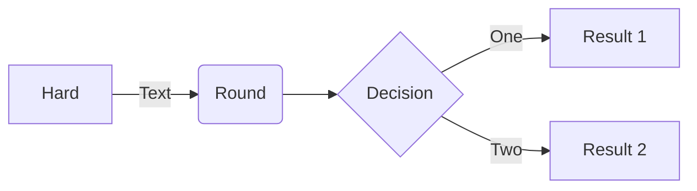

# likkochan.github.io

https://codepen.io/likkochan/pens/

    

  <>

  
  

<!--Dayspedia.com widget--><iframe width='210' height='317' style='padding:0!important;margin:0!important;border:none!important;background:none!important;background:transparent!important' marginheight='0' marginwidth='0' frameborder='0' scrolling='no' comment='/*defined*/' src='https://dayspedia.com/if/analog/?v=1&iframe=eyJ3LTExIjpmYWxzZSwidy0xMyI6dHJ1ZSwidy0xNSI6dHJ1ZSwidy0xMTAiOmZhbHNlLCJ3LXdpZHRoLTAiOnRydWUsInctd2lkdGgtMSI6ZmFsc2UsInctd2lkdGgtMiI6ZmFsc2UsInctMTYiOiIyNHB4Iiwidy0xNyI6IjE2Iiwidy0yMSI6dHJ1ZSwiYmdpbWFnZSI6NCwiYmdpbWFnZVNldCI6dHJ1ZSwidy0yMWMwIjoiI2ZmZmZmZiIsInctMCI6dHJ1ZSwidy0zIjp0cnVlLCJ3LTNjMCI6IiMzNDM0MzQiLCJ3LTNiMCI6IjEiLCJ3LTIwIjp0cnVlLCJ3LTQiOiIjZjdmN2Y3Iiwidy0xOCI6ZmFsc2UsInctd2lkdGgtMmMtMCI6IjMwMCIsInctMTE1IjpmYWxzZSwidy0yMyI6dHJ1ZSwidy0yM2MwIjoiI2VmZWJlZSIsInctMjYiOmZhbHNlLCJ3LTI2YjAiOiIxIiwidy0yNyI6dHJ1ZSwidy0yN2MwIjoiIzQ4MDQyMiIsInctMjQiOiIjMzQzNDM0Iiwidy0xM2MwIjoiIzViMTUyYiIsInctMjIiOiIjZmZmYWZjIiwidy0yNSI6IjE2MCJ9&lang=ru&cityid=5720'></iframe><!--Dayspedia.com widget ENDS-->
  

  

  
  
  
  

  

<link rel="stylesheet" href="./CSS/style.css">

<a class="iksweb" href="https://github.com/likkochan" target="_blank"  title="Pop in">Pop in</a>

<iframe width="768" height="432" src="https://miro.com/app/live-embed/uXjVPCEx3wU=/?moveToViewport=-800,-655,1622,1153&embedId=587551173754" frameborder="0" scrolling="no" allowfullscreen></iframe>

https://view.genial.ly/639b3d493c2c77001a1ad856/interactive-image-interactive-image

