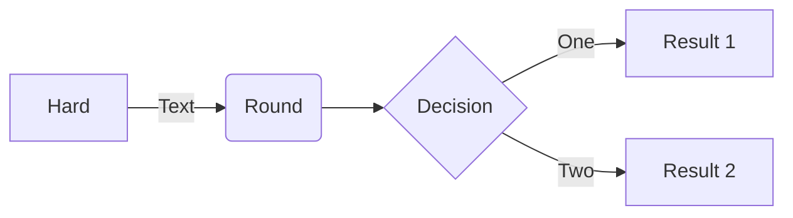

# likkochan.github.io

https://codepen.io/likkochan/pens/

<link rel="stylesheet" href="./CSS/style.css">

<a class="iksweb" href="https://github.com/likkochan" target="_blank"  title="Pop in">Pop in</a>

<iframe width="768" height="432" src="https://miro.com/app/live-embed/uXjVPCEx3wU=/?moveToViewport=-800,-655,1622,1153&embedId=587551173754" frameborder="0" scrolling="no" allowfullscreen></iframe>
